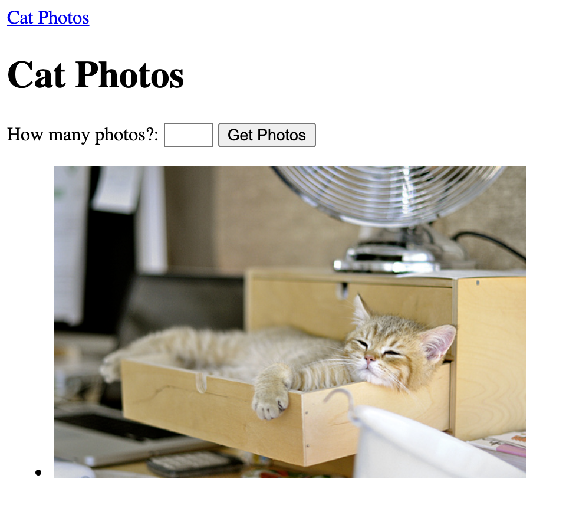
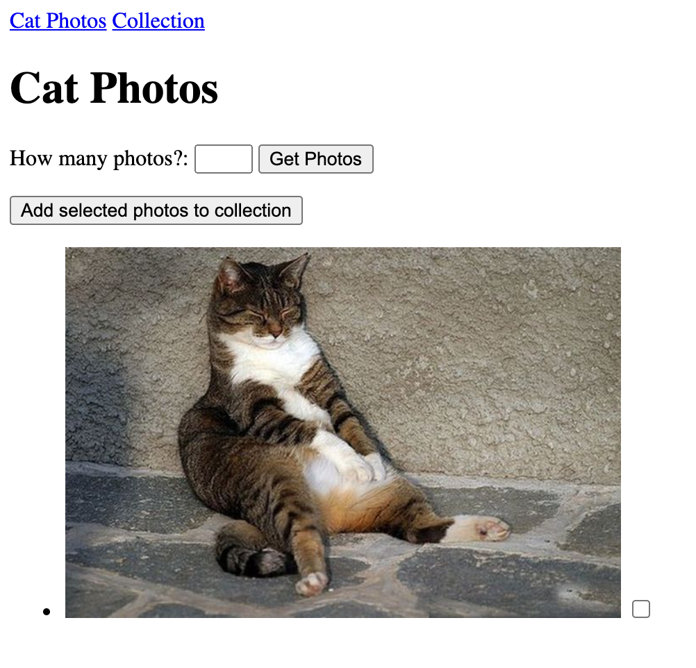
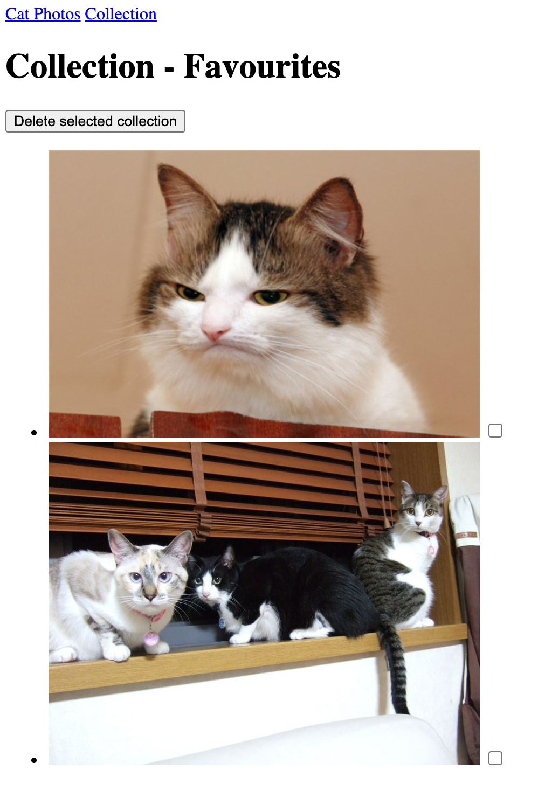

# Cat Photo Collection

## 개요

- [The Cat API](https://thecatapi.com/)를 활용하여 고양이 이미지를 조회하고, 이미지를 저장하는 Spring Boot Web Application 구현

## 목표

- Spring Boot Application의 기본 구조에 대한 이해
- Template Engine(Thymeleaf)의 활용
- 외부 API의 활용

## 준비 사항

- Spring Boot >= 2.4
- [The Cat API](https://thecatapi.com)의 API Key
    - 회원 가입을 진행하고, 가입한 이메일로 API Key 발급


## 요구 사항

### 0. 주의 사항

- API 요청은 JavaScript가 아닌 **Spring Application에서** 생성
- CSS를 이용한 레이아웃의 스타일링은 **선택적으로** 진행
- '구현 예시'는 참고 용도로만 제공되는 것이며, 반드시 **똑같이 구현할 필요 없음**
- 아래의 명세에 명시되지 않은 내용은 **자유롭게** 구현

### 1. Cat Photos

- API로부터 고양이 이미지에 대한 데이터를 받아와 해당 이미지를 조회
    - 사용자로부터 숫자를 입력 받아, 해당 숫자 만큼의 이미지를 조회
    - 입력된 숫자가 없더라도 적어도 1개 이상의 이미지를 조회
- 구현 예시
    - Cat Photos View

        

### 2. Collection - Favourites

- The Cat API의 Favourites 기능 활용 (API Key 필요)
    - Cat Photos에서 조회한 고양이 이미지를 선택하여 Collection에 저장
    - Collection에 저장된 이미지를 조회
    - Collection에 저장된 이미지를 선택하여 삭제
- 구현 예시
    - Cat Photos View

        

- 구현 예시
    - Collection View

        

### 3. (선택) Test Code
- 구현한 기능이 정상 동작하는지 검증하기 위한 테스트 코드 작성
- Unit Test, Spring Boot Integration Test 활용


## 제출 방법

- Git을 통해 프로젝트 URL의 GitHub repository를 로컬로 clone

    ```bash
    $ git clone https://github.com/coupang-edu/c4e-springboot-project-01
    $ cd c4e-springboot-project-01
    ```

- 본인의 `사내 이메일의 아이디 부분`으로 branch 생성 및 이동

    ```bash
    $ git switch -c john
    ```

- 코드 작성이 완료된 프로젝트를, 아래와 같이 프로젝트 폴더명을 본인의 영문명으로 변경

    ```bash
    README.md
    john/
        ├── gradle/
        ├── src/
        ├── build.gradle
        ├── gradlew
        ├── gradlew.bat
        └── settings.gradle
    ```

- 코드 작성 완료 후, 해당 branch를 push

    ```bash
    $ git push origin john
    ```

- Pull Request 생성하여 제출 완료
